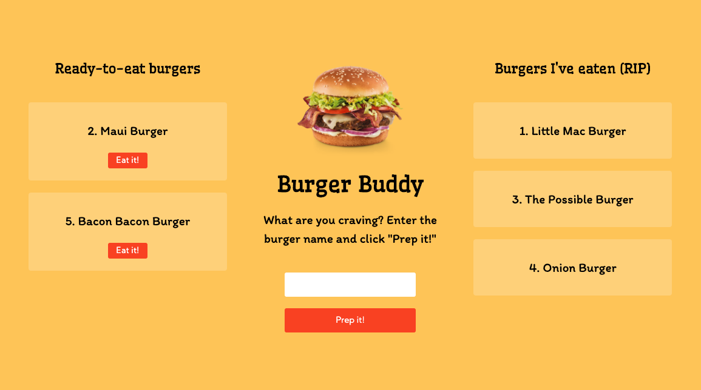

# Burger-Buddy

## Table of Contents

* [Description](#description)
* [Screenshot](#screenshot)
* [Contributions](#contributions)
* [License](#license)

## Description

A playful app to keep track of my burger ambitions and conquests. Primarily an exercise in understanding the relationship between front-end AJAX and back-end Controller, Model and ORM. All layouts and DOM updates generated via handlebars.

## Screenshot

## Contributions

Thanks to my tutor for helping me understand the mysteries of the ORM.

## License

MIT License

Copyright (c) 2020 Andrew Stewart

